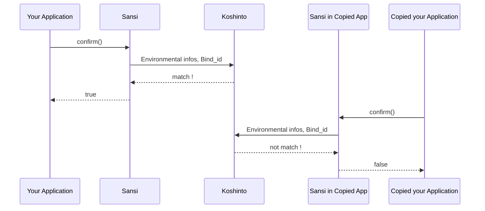

# sansi_examples

A sample project of how to protect your application against unauthorized copying, with the **sansi** library.

The sansi is a license manager library for Linux (x86 and ARM) and Mac (x86), by working with [Koshinto](https://koshinto.uedasoft.com/docs/) service, it provides an **out-of-the-box copy protection** feature to your application.

The sansi does not use license definition files that can be cumbersome to manage properly and can cause weaknesses and accidents.
Instead, the information that determines whether an application can be run is securely stored in koshinto in combination with the Bind_id that uniquely identifies the application.
Each sansi library has a unique Bind_id embedded internally as binary since at the time you have downloaded it from the koshinto.

sansi provides the function **confirm()** for your application.
The confirm() collects various environmental information (e.g.  IP address, Mac address, device unique ID, SD card unique ID, etc.) that can be used to uniquely identify the environment in which the application is executed, and sends it to koshinto together with Bind_id.

Koshinto compares the sent environment information with the stored execution conditions and responds whether the application can be executed or not.
The confirm () returns it to the application as a return value.

Therefore, you can protect your application from piracy simply by checking the return value of confirm () when starting your application and exiting if it is not OK. That's it!

The sansi embedded in your application can be operated through the Koshinto Service. You can download the Sansi library from your account of Koshinto, and perform all operations such as setting and changing keys from your mobile device through Koshinto's web interface.

For detail of **Sansi** and **Koshinto**, refer https://koshinto.uedasoft.com/docs/.

## Embed sansi into your application
