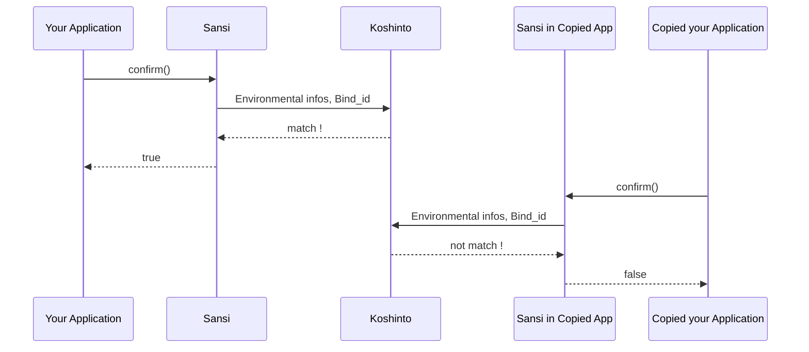

# sansi_examples

A sample project of how to protect your application against unauthorized copying, with the **sansi** library.

The sansi is a license manager library for Linux (x86 and ARM) and Mac (x86), by working with [Koshinto](https://koshinto.uedasoft.com/docs/) service, it provides an **out-of-the-box copy protection** feature to your application.

## Why the sansi is an out-of-the-box copy protection.

Because the sansi **does not use license definition files nor license key** which can be troublesome that in case not handled carefully, it can be a security weak point or cause an accident.
Instead, sansi handle the license by the manner of **client-server**. The license information, which is called **Bind**, is securely **stored in the koshinto server**.
Each sansi library, which works as a **client**, has a unique Bind_id embedded internally as binary since at the time you have downloaded it.

## How sansi protect your application against unauthorized copying by the manner of **client-server**.
sansi provides the function **confirm()** for your application.
The confirm() collects various environmental information (e.g.  IP address, Mac address, device unique ID, SD card unique ID, etc.) that can be used to uniquely identify the environment in which the application is executed, and sends it to koshinto together with Bind_id.

Koshinto compares the sent environment information with the stored execution conditions and responds whether the application can be executed or not.
The confirm () returns it to the application as a return value.


Therefore, you can protect your application from piracy simply by **checking the return value of confirm () at your application start point and exiting if it is not OK**. That's it!



## What applications are suitable for, and not for.
### for
**Linux (x86, arm)** and **Mac (x86)** applications that are always connected to the network.
Especially when using on **Raspberry Pi**, you can limit the launch of your application to get permitted only on a specific RPi board or from a specific SD card. 

Using on **Mac**, you can limit the launch of your application to get permitted only on a Mac PC that has a specific serial number.
On all types of machines, you can also bind by **IP address** or **Mac address**, so you can use an **inexpensive WiFi dongle** as a substitute for a **USB Key dongle**.

For now, only Raspberry Pi and Mac can bind applications to device serial numbers due to our lack of the device for technical works.
We welcome your donation of other devices that we can use for technical work to make it be supported on the roadmap.

### not for
For now, sansi does not support Windows due to our lack of the development environment.
We welcome your donation of a Windows PC that we can use for technical work to make Windows supported on the roadmap.

In principle,　applications used without a network are not available with sansi.

## How to get started.

Refer Koshinto document of [get-started](https://koshinto.uedasoft.com/docs/guide/getting-started/signup.html).

## How to embed sansi into your application
### Dependency
The dependency of the sansi is only with **libssl** and **libcrypto** of the **OpenSSL**. So you can embed sansi library in your application by just link with the openssl and their dependencies like as follows:

```
 -lssl -lcrypto -lpthread -ldl -lm
 ```

I think OpenSSL is pre-installed in most Linux, but it may not be installed on the Mac. In any case, if it is not installed, you need to install it properly.

### Sample project
The samples in the following languages are available.
- [C](c)
- [Go](go)
- [Python](python)
- [Bash](bash)
