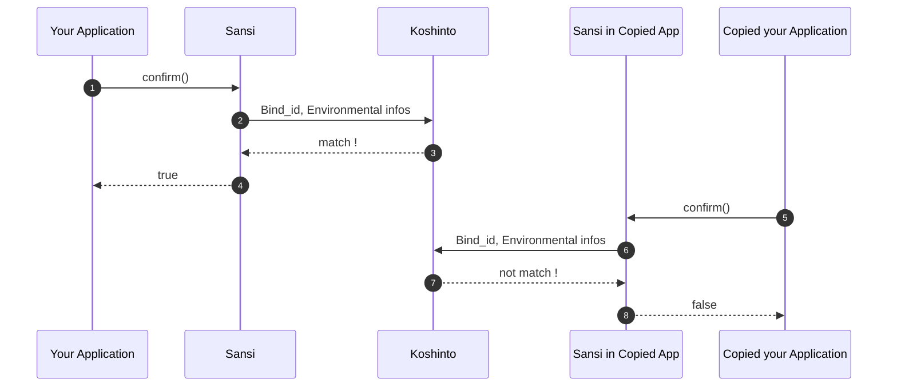

# sansi_examples

A sample project of how to protect your application against unauthorized copying, with the **sansi** library.

The sansi is a license manager library for Linux (x86 and ARM) and Mac (x86), by working with [Koshinto](https://koshinto.uedasoft.com/docs/) service, it provides an **out-of-the-box copy protection** feature to your application.

## How sansi protect your application against unauthorized copying by working with [Koshinto](https://koshinto.uedasoft.com/docs/)
The **confirm()** function provided by sansi 

The sansi embedded in your application can be operated through the Koshinto Service. You can download the Sansi library from your account of Koshinto, and perform all operations such as setting and changing keys from your mobile device through Koshinto's web interface.

For detail of **Sansi** and **Koshinto**, refer https://koshinto.uedasoft.com/docs/.

## Embed sansi into your application
