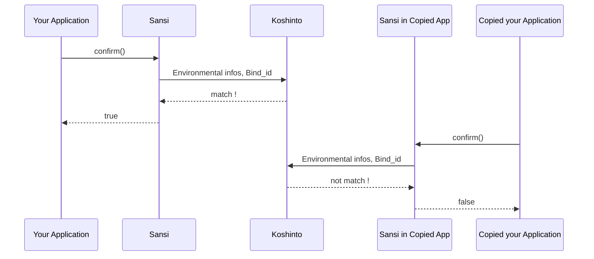

```mermaid
sequenceDiagram;
participant Your Application
participant Sansi
participant Koshinto
participant Sansi in Copied App
participant Copied your Application

Your Application->>Sansi: confirm()
Sansi->>Koshinto: Environmental infos, Bind_id
Koshinto-->>Sansi: match !
Sansi-->>Your Application: true

Copied your Application->>Sansi in Copied App: confirm()
Sansi in Copied App->>Koshinto: Environmental infos, Bind_id
Koshinto-->>Sansi in Copied App: not match !
Sansi in Copied App-->>Copied your Application: false
```
